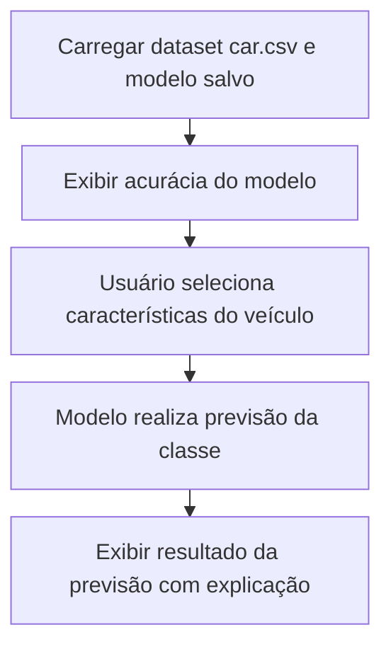
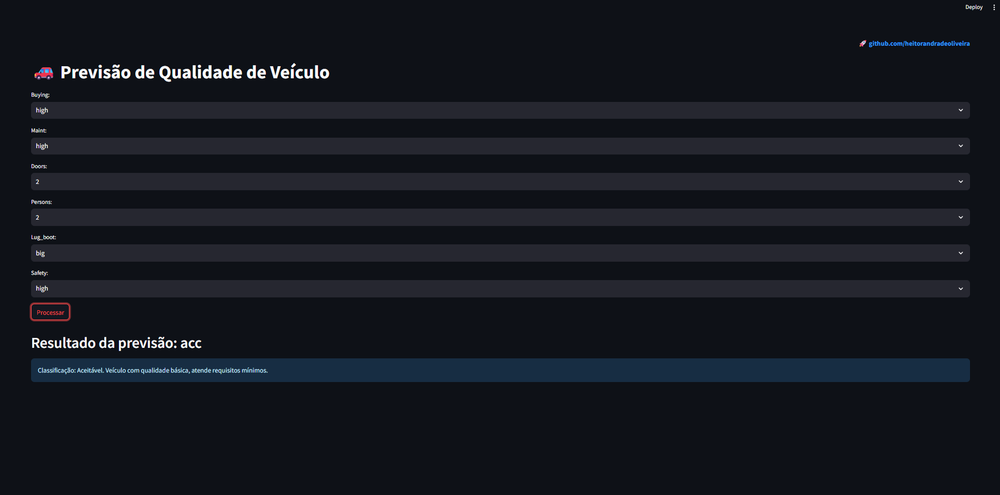

# Classificação de Veículos com Naive Bayes

Este projeto apresenta uma aplicação simples em Streamlit para classificação de veículos segundo características categóricas, usando o algoritmo **Naive Bayes Categórico**.

## Objetivo

- Treinar um modelo de classificação para prever a qualidade/classificação do veículo.
- Aplicar codificação ordinal para variáveis categóricas.
- Disponibilizar interface web interativa para o usuário inserir características e receber a previsão.

## 🗂 Estrutura do Projeto

```
├── app/
│   ├── app.py # Código da aplicação Streamlit
│   ├── encoder.joblib # codificador
│   └── model.joblib # modelo
├── train_model/
│   ├── car.csv # Base de dados
│   └── train_model.py # Código de treinamento
├── assets/
├── LICENSE # Licença MIT
├── README.md # Documentação do projeto
└── requirements.txt # Dependências do projeto

```

---

## 📊 Exemplo de Uso

- Escolha as características do veículo nos menus dropdown.
- Clique em **Processar** para ver a previsão da classe do veículo.
- A acurácia do modelo é exibida na tela principal.

---

## Como Executar Localmente

1. **Clone o repositório**
   ```bash
   git clone https://github.com/seu-usuario/nome-repositorio.git
   cd nome-repositorio
   ```

---

## Configuração do Ambiente Conda para o Projeto

Este guia descreve como configurar corretamente o ambiente Conda para executar o projeto.

### Passo a Passo

Criar o ambiente Conda com Python 3.10

```
conda create -n apps_streamlit python=3.10 pip
conda activate apps_streamlit
```

#### Instalar as dependências

```
pip install -r requirements.txt
```

## Crie um ambiente virtual e instale as dependências sem Conda

```
python -m venv venv
source venv/bin/activate   # Linux/Mac
venv\Scripts\activate      # Windowspip install -r requirements.txt
```

---

## Execute o Streamlit

```
streamlit run ./app/app.py
```

## Acesse no navegador

```
http://localhost:8501
```

---

## Fluxo do App



---

### Captura de Tela da Aplicação

Abaixo está uma captura da interface do aplicativo em execução localmente.
O usuário pode selecionar características do veículo nos menus dropdown e obter a previsão da qualidade/classificação do veículo, junto com uma explicação amigável do resultado.



---

## Licença

Este projeto está sob a licença MIT - veja o arquivo [LICENSE](./LICENSE) para detalhes.

---

## Contato

LinkedIn: [linkedin.com/in/heitorandradeoliveira](https://linkedin.com/in/heitorandradeoliveira)

---
